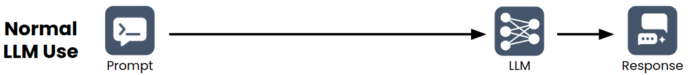
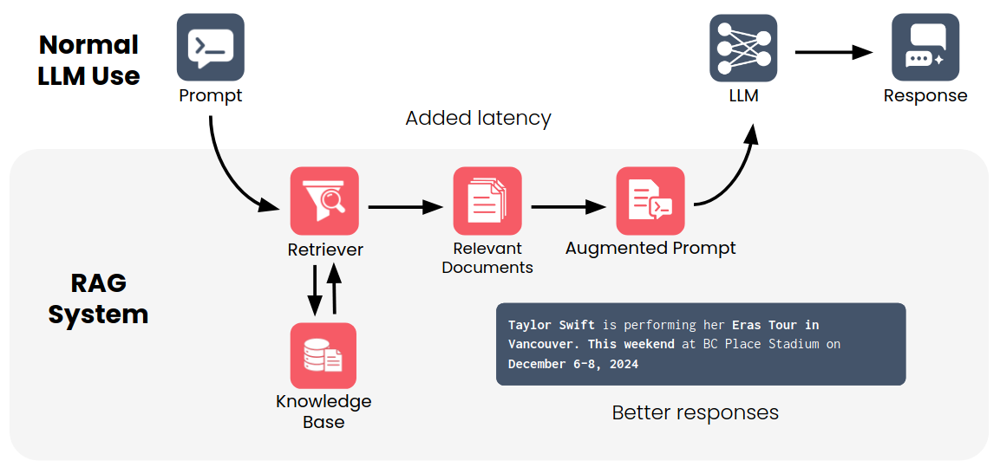

### Overview
This repository contains implementations of RAG (Retrieval-Augmented Generation) techniques.

### What?
- **Retrieval**: Searching and fetching relevant information from external knowledge base(database, documents, ...) in response to a user query.
- **Augmentation**: Retrieved information then being integrated into the LLM's prompt to enrich it with contextual details, creates an "augmented" prompt that guides the model more effectively, preventing it from hallucinating or generating generic responses.
- **Generation**: Just generate the output from the above step

In conclusion, RAG is a technique that enhances the capabilities of LLMs by combining information retrieval with generative processes. It ensures LLMs can leverage external, up-to-date knowledge, leading to more reliable and accurate outputs.
### Why?
- LLMs can't access confidential (private data), uncommon(specific data), or up-to-date information. This approach addresses LLM limitations, such as producing outdated information or hallucinations.
### How?
- Traditional LLMs:


- RAG:



### API
I use the Google Gemini API in this repository because I can't afford the OpenAI API, but an OpenAI-compatible version will be included.
### Notes
- The hardware requirements are increasing as APIs from major companies have usage limits, so consider using local models on Colab.
- I don't want to quantize models (like Qwen1.5-1.8B) because they are small enough for text generation. Quantizing them would significantly reduce their performance.
### Usage
1. Clone this repository
```bash
git clone https://github.com/quangliz/rag.git
cd rag
```
2. Install requirements
```bash
pip install -r requirements.txt
```
3. Modify conf.env.example (then remove the ".example" suffix)